###########
Puppetboard
###########

.. image:: https://travis-ci.org/voxpupuli/puppetboard.svg?branch=master
   :target:  https://travis-ci.org/voxpupuli/puppetboard

.. image:: https://coveralls.io/repos/github/voxpupuli/puppetboard/badge.svg?branch=master
   :target:  https://coveralls.io/github/voxpupuli/puppetboard?branch=master

Puppetboard is a web interface to `PuppetDB`_ aiming to replace the reporting
functionality of `Puppet Dashboard`_.

Puppetboard relies on the `pypuppetdb`_ library to fetch data from PuppetDB
and is built with the help of the `Flask`_ microframework.

As of version 0.1.0 and higher, Puppetboard **requires** PuppetDB 3.

.. _pypuppetdb: https://pypi.python.org/pypi/pypuppetdb
.. _PuppetDB: http://docs.puppetlabs.com/puppetdb/latest/index.html
.. _Puppet Dashboard: http://docs.puppetlabs.com/dashboard/
.. _Flask: http://flask.pocoo.org
.. _FlaskSession: http://flask.pocoo.org/docs/0.11/quickstart/#sessions

At the current time of writing, Puppetboard supports the following Python versions:
    * Python 2.6
    * Python 2.7

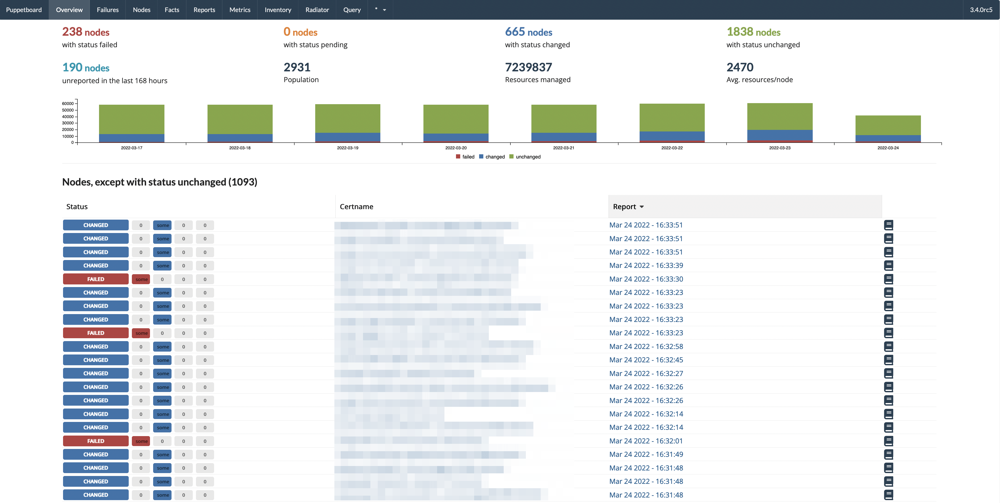

.. contents::

Word of caution
===============

Puppetboard is very, very young but it works fairly well.

That being said a lot of the code is very experimental, just trying
to figure out what works and what not, what we need to do different
and what features we need on the PuppetDB side of things.

As such you should be at least comfortable handling a few errors
this might throw at you.

Installation
============

Puppetboard is now packaged and available on PyPi.

Production
----------

Puppet module
^^^^^^^^^^^^^
There is a `Puppet module`_ by `Spencer Krum`_ that takes care of installing Puppetboard for you.

You can install it with:

    puppet module install puppet-puppetboard

.. _Spencer Krum: https://github.com/nibalizer
.. _Puppet module: https://forge.puppetlabs.com/puppet/puppetboard

Manual
^^^^^^

To install it simply issue the following command:

.. code-block:: bash

   $ pip install puppetboard

This will install Puppetboard and take care of the dependencies. If you
do this Puppetboard will be installed in the so called site-packages or
dist-packages of your Python distribution.

The complete path on Debian and Ubuntu systems would be ``/usr/local/lib/pythonX.Y/lib/dist-packages/puppetboard`` and on Fedora would be ``/usr/lib/pythonX.Y/site-packages/puppetboard``

where X and Y are replaced by your major and minor python versions.

You will need this path in order to configure your HTTPD and WSGI-capable
application server.

Packages
^^^^^^^^
Native packages for your operating system will be provided in the near future.

+-------------------+-----------+--------------------------------------------+
| OS                | Status    |                                            |
+===================+===========+============================================+
| Debian 6/Squeeze  | planned   | Requires Backports                         |
+-------------------+-----------+--------------------------------------------+
| Debian 7/Wheezy   | planned   |                                            |
+-------------------+-----------+--------------------------------------------+
| Ubuntu 13.04      | planned   |                                            |
+-------------------+-----------+--------------------------------------------+
| Ubuntu 13.10      | planned   |                                            |
+-------------------+-----------+--------------------------------------------+
| CentOS/RHEL 5     | n/a       | Python 2.4                                 |
+-------------------+-----------+--------------------------------------------+
| CentOS/RHEL 6     | planned   |                                            |
+-------------------+-----------+--------------------------------------------+
| `OpenSuSE 12/13`_ | available | Maintained on `OpenSuSE Build Service`_    |
+-------------------+-----------+--------------------------------------------+
| `SuSE LE 11 SP3`_ | available | Maintained on `OpenSuSE Build Service`_    |
+-------------------+-----------+--------------------------------------------+
| `ArchLinux`_      | available | Maintained by `Tim Meusel`_                |
+-------------------+-----------+--------------------------------------------+
| `OpenBSD`_        | available | Maintained by `Jasper Lievisse Adriaanse`_ |
+-------------------+-----------+--------------------------------------------+

.. _ArchLinux: https://aur.archlinux.org/packages/python2-puppetboard/
.. _Tim Meusel: https://github.com/bastelfreak
.. _Jasper Lievisse Adriaanse: https://github.com/jasperla
.. _OpenBSD: http://www.openbsd.org/cgi-bin/cvsweb/ports/www/puppetboard/
.. _OpenSuSE Build Service: https://build.opensuse.org/package/show/systemsmanagement:puppet/python-puppetboard
.. _OpenSuSE 12/13: https://build.opensuse.org/package/show/systemsmanagement:puppet/python-puppetboard
.. _SuSE LE 11 SP3: https://build.opensuse.org/package/show/systemsmanagement:puppet/python-puppetboard

Docker Images
^^^^^^^^^^^^^

A `Dockerfile`_ was added to the source-code in the 0.2.0 release. An officially
image is planned for the 0.2.x series.

.. _Dockerfile: https://github.com/voxpupuli/puppetboard/blob/master/Dockerfile

Usage:
.. code-block:: bash
  $ docker build -t puppetboard .
  $ docker run -it -p 9080:80 -v /etc/puppetlabs/puppet/ssl:/etc/puppetlabs/puppet/ssl \
    -e PUPPETDB_HOST=<hostname> \
    -e PUPPETDB_PORT=8081 \
    -e PUPPETDB_SSL_VERIFY=/etc/puppetlabs/puppetdb/ssl/ca.pem \
    -e PUPPETDB_KEY=/etc/puppetlabs/puppetdb/ssl/private.pem \
    -e PUPPETDB_CERT=/etc/puppetlabs/puppetdb/ssl/public.pem \
    -e INVENTORY_FACTS='Hostname,fqdn, IP Address,ipaddress' \
    -e ENABLE_CATALOG=true \
    -e GRAPH_FACTS='architecture,puppetversion,osfamily' \
    puppetboard

Development
-----------

If you wish to hack on Puppetboard you should fork/clone the Github repository
and then install the requirements through:

.. code-block:: bash

   $ pip install -r requirements.txt

You're advised to do this inside a virtualenv specifically created to work on
Puppetboard as to not pollute your global Python installation.

Configuration
=============
The following instructions will help you configure Puppetboard and your HTTPD.

Puppet
------
Puppetboard is built completely around PuppetDB which means your environment
needs to be configured `to do that`_.

In order to get the reports to show up in Puppetboard you need to configure
your environment to store those reports in PuppetDB. Have a look at
`the documentation`_ about this, specifically the *Enabling report storage*
section.

.. _to do that: https://docs.puppetlabs.com/puppetdb/latest/connect_puppet_master.html#step-2-edit-config-files
.. _the documentation: https://docs.puppetlabs.com/puppetdb/latest/connect_puppet_master.html#edit-puppetconf

Settings
--------
Puppetboard will look for a file pointed at by the ``PUPPETBOARD_SETTINGS``
environment variable. The file has to be identical to ``default_settings.py``
but should only override the settings you need changed.

You can grab a copy of ``default_settings.py`` from the path where pip
installed Puppetboard to or by looking in the source checkout.

If you run PuppetDB and Puppetboard on the same machine the default settings
provided will be enough to get you started and you won't need a custom
settings file.

Assuming your webserver and PuppetDB machine are not identical you will at
least have to change the following settings:

* ``PUPPETDB_HOST``
* ``PUPPETDB_PORT``

By default PuppetDB requires SSL to be used when a non-local client wants to
connect. Therefor you'll also have to supply the following settings:

* ``PUPPETDB_SSL_VERIFY = /path/to/ca/keyfile.pem``
* ``PUPPETDB_KEY = /path/to/private/keyfile.pem``
* ``PUPPETDB_CERT = /path/to/public/keyfile.crt``

For information about how to generate the correct keys please refer to the
`pypuppetdb documentation`_.

Other settings that might be interesting in no particular order:

* ``SECRET_KEY``: Refer to `Flask documentation`_, section sessions: How to
  generate good secret keys, to set the value. Defaults to a random 24-char
  string generated by os.random(24)
* ``PUPPETDB_TIMEOUT``: Defaults to 20 seconds but you might need to increase
  this value. It depends on how big the results are when querying PuppetDB.
  This behaviour will change in a future release when pagination will be
  introduced.
* ``UNRESPONSIVE_HOURS``: The amount of hours since the last check-in after
  which a node is considered unresponsive.
* ``LOGLEVEL``: A string representing the loglevel. It defaults to ``'info'``
  but can be changed to ``'warning'`` or ``'critical'`` for less verbose
  logging or ``'debug'`` for more information.
* ``ENABLE_QUERY``: Defaults to ``True`` causing a Query tab to show up in the
  web interface allowing users to write and execute arbitrary queries against
  a set of endpoints in PuppetDB. Change this to ``False`` to disable this.
* ``GRAPH_TYPE```: Specify the type of graph to display.   Default is
  pie, other good option is donut.   Other choices can be found here:
  `_C3JS_documentation`
* ``GRAPH_FACTS``: A list of fact names to tell PuppetBoard to generate a
  pie-chart on the fact page. With some fact values being unique per node,
  like ipaddress, uuid, and serial number, as well as structured facts it was
  no longer feasible to generate a graph for everything.
* ``INVENTORY_FACTS``: A list of tuples that serve as the column header and
  the fact name to search for to create the inventory page. If a fact is not
  found for a node then ``undef`` is printed.
* ``ENABLE_CATALOG``: If set to ``True`` allows the user to view a node's
  latest catalog. This includes all managed resources, their file-system
  locations and their relationships, if available. Defaults to ``False``.
* ``REFRESH_RATE``: Defaults to ``30`` the number of seconds to wait until
  the index page is automatically refreshed.
* ``DEFAULT_ENVIRONMENT``: Defaults to ``'production'``, as the name
  suggests, load all information filtered by this environment value.
* ``REPORTS_COUNT``: Defaults to ``10`` the limit of the number of reports
  to load on the node or any reports page.
* ``OFFLINE_MODE``: If set to ``True`` load static assets (jquery,
  semantic-ui, etc) from the local web server instead of a CDN.
  Defaults to ``False``.

.. _pypuppetdb documentation: http://pypuppetdb.readthedocs.org/en/v0.1.0/quickstart.html#ssl
.. _Flask documentation: http://flask.pocoo.org/docs/0.10/quickstart/#sessions
.. _C3JS_documentation:  http://c3js.org/examples.html#chart

Puppet Enterprise
-----------------

Puppet Enterprise maintains a certificate white-list for which certificates
are allowed to access data from PuppetDB. This whitelist is maintained in
``/etc/puppetlabs/puppetdb/certificate-whitelist`` and you have to add the
certificate name to that file.

Afterwards you'll need to restart ``pe-puppetdb`` and you should be able to
query PuppetDB freely now.

Development
-----------

You can run it in development mode by simply executing:

.. code-block:: bash

   $ python dev.py

Use ``PUPPETBOARD_SETTINGS`` to change the different settings or patch
``default_settings.py`` directly. Take care not to include your local changes on
that file when submitting patches for Puppetboard. Place a settings.py file
inside the base directory of the git repository that will be used, if the
environment variable is not set.

Production
----------
To run Puppetboard in production we provide instructions for the following
scenarios:

* Apache + mod_wsgi
* Apache + mod_passenger
* nginx + uwsgi
* nginx + gunicorn

If you deploy Puppetboard through a different setup we'd welcome a pull
request that adds the instructions to this section.

Apache + mod_wsgi
^^^^^^^^^^^^^^^^^

First we need to create the necessary directories:

.. code-block:: bash

   $ mkdir -p /var/www/html/puppetboard

Copy Puppetboard's ``default_settings.py`` to the newly created puppetboard
directory and name the file ``settings.py``. This file will be available
at the path Puppetboard was installed, for example:
``/usr/local/lib/pythonX.Y/lib/dist-packages/puppetboard/default_settings.py``.

Change the settings that need changing to match your environment and delete
or comment with a ``#`` the rest of the entries.

If you don't need to change any settings you can skip the creation of the
``settings.py`` file entirely.

Now create a ``wsgi.py`` with the following content in the newly created
puppetboard directory:

.. code-block:: python

    from __future__ import absolute_import
    import os

    # Needed if a settings.py file exists
    os.environ['PUPPETBOARD_SETTINGS'] = '/var/www/html/puppetboard/settings.py'
    from puppetboard.app import app as application

Make sure this file is readable by the user the webserver runs as.

Flask requires a static secret_key, see `FlaskSession`_, in order to protect
itself from CSRF exploits.  The default secret_key in ``default_settings.py``
generates a random 24 character string, however this string is re-generated
on each request under httpd >= 2.4.

To generate your own secret_key create a python script with the following content
and run it once:

.. code-block:: python

    import os
    os.urandom(24)
    '\xfd{H\xe5<\x95\xf9\xe3\x96.5\xd1\x01O<!\xd5\xa2\xa0\x9fR"\xa1\xa8'

Copy the output and add the following to your ``wsgi.py`` file:

.. code-block:: python

   application.secret_key = '<your secret key>'

The last thing we need to do is configure Apache.

Here is a sample configuration for Debian and Ubuntu:

.. code-block:: apache

    <VirtualHost *:80>
        ServerName puppetboard.example.tld
        WSGIDaemonProcess puppetboard user=www-data group=www-data threads=5
        WSGIScriptAlias / /var/www/html/puppetboard/wsgi.py
        ErrorLog /var/log/apache2/puppetboard.error.log
        CustomLog /var/log/apache2/puppetboard.access.log combined

        Alias /static /usr/local/lib/pythonX.Y/dist-packages/puppetboard/static
        <Directory /usr/local/lib/pythonX.X/dist-packages/puppetboard/static>
            Satisfy Any
            Allow from all
        </Directory>

        <Directory /usr/local/lib/pythonX.Y/dist-packages/puppetboard>
            WSGIProcessGroup puppetboard
            WSGIApplicationGroup %{GLOBAL}
            Order deny,allow
            Allow from all
        </Directory>
    </VirtualHost>

Here is a sample configuration for Fedora:

.. code-block:: apache

    <VirtualHost *:80>
        ServerName puppetboard.example.tld
        WSGIDaemonProcess puppetboard user=apache group=apache threads=5
        WSGIScriptAlias / /var/www/html/puppetboard/wsgi.py
        ErrorLog logs/puppetboard-error_log
        CustomLog logs/puppetboard-access_log combined

        Alias /static /usr/lib/pythonX.Y/site-packages/puppetboard/static
        <Directory /usr/lib/python2.X/site-packages/puppetboard/static>
            Satisfy Any
            Allow from all
        </Directory>

        <Directory /usr/lib/pythonX.Y/site-packages/puppetboard>
            WSGIProcessGroup puppetboard
            WSGIApplicationGroup %{GLOBAL}
            Require all granted
        </Directory>
    </VirtualHost>


Note the directory path, it's the path to where pip installed Puppetboard; X.Y
must be replaced with your python version. We also alias the ``/static`` path
so that Apache will serve the static files like the included CSS and Javascript.

Apache + mod_passenger
^^^^^^^^^^^^^^^^^^^^^^

It is possible to run Python applications through Passenger. Passenger has
supported this since version 3 but it's considered experimental. Since the
release of Passenger 4 it's a 'core' feature of the product.

Performance wise it also leaves something to be desired compared to the
mod_wsgi powered solution. Application start up is noticeably slower and
loading pages takes a fraction longer.

First we need to create the necessary directories:

.. code-block:: bash

   $ mkdir -p /var/www/puppetboard/{tmp,public}

Copy Puppetboard's ``default_settings.py`` to the newly created puppetboard
directory and name the file ``settings.py``. This file will be available
at the path Puppetboard was installed, for example:
``/usr/local/lib/pythonX.Y/lib/dist-packages/puppetboard/default_settings.py``.

Change the settings that need changing to match your environment and delete
or comment with a ``#`` the rest of the entries.

If you don't need to change any settings you can skip the creation of the
``settings.py`` file entirely.

Now create a ``passenger_wsgi.py`` with the following content in the newly
created puppetboard directory:

.. code-block:: python

    from __future__ import absolute_import
    import os
    import logging

    logging.basicConfig(filename='/path/to/file/for/logging', level=logging.INFO)

    # Needed if a settings.py file exists
    os.environ['PUPPETBOARD_SETTINGS'] = '/var/www/puppetboard/settings.py'

    try:
        from puppetboard.app import app as application
    except Exception, inst:
        logging.exception("Error: %s", str(type(inst)))

Unfortunately due to the way Passenger works we also need to configure logging
inside ``passenger_wsgi.py`` else application start up issues won't be logged.

This means that even though ``LOGLEVEL`` might be set in your ``settings.py``
this setting will take precedence over it.

Now the only thing left to do is configure Apache:

.. code-block:: apache

   <VirtualHost *:80>
       ServerName puppetboard.example.tld
       DocumentRoot /var/www/puppetboard/public
       ErrorLog /var/log/apache2/puppetboard.error.log
       CustomLog /var/log/apache2/puppetboard.access.log combined

       RackAutoDetect On
       Alias /static /usr/local/lib/pythonX.Y/dist-packages/puppetboard/static
   </VirtualHost>

Note the ``/static`` alias path, it's the path to where pip installed
Puppetboard. This is needed so that Apache will serve the static files like
the included CSS and Javascript.

nginx + uwsgi
^^^^^^^^^^^^^
A common Python deployment scenario is to use the uwsgi application server
(which can also serve rails/rack, PHP, Perl and other applications) and proxy
to it through something like nginx or perhaps even HAProxy.

uwsgi has a feature that every instance can run as its own user. In this
example we'll use the ``www-data`` user but you can create a separate user
solely for running Puppetboard and use that instead.

First we need to create the necessary directories:

.. code-block:: bash

   $ mkdir -p /var/www/puppetboard

Copy Puppetboard's ``default_settings.py`` to the newly created puppetboard
directory and name the file ``settings.py``. This file will be available
at the path Puppetboard was installed, for example:
``/usr/local/lib/pythonX.Y/lib/dist-packages/puppetboard/default_settings.py``.

Change the settings that need changing to match your environment and delete
or comment with a ``#`` the rest of the entries.

If you don't need to change any settings you can skip the creation of the
``settings.py`` file entirely.

Now create a ``wsgi.py`` with the following content in the newly created
puppetboard directory:

.. code-block:: python

    from __future__ import absolute_import
    import os

    # Needed if a settings.py file exists
    os.environ['PUPPETBOARD_SETTINGS'] = '/var/www/puppetboard/settings.py'
    from puppetboard.app import app as application

Make sure this file is owned by the user and group the uwsgi instance will run
as.

Now we need to start uwsgi:

.. code-block:: bash

   $ uwsgi --socket :9090 --wsgi-file /var/www/puppetboard/wsgi.py

Feel free to change the port to something other than ``9090``.

The last thing we need to do is configure nginx to proxy the requests:

.. code-block:: nginx

   upstream puppetboard {
       server 127.0.0.1:9090;
   }

   server {
       listen      80;
       server_name puppetboard.example.tld;
       charset     utf-8;

       location /static {
           alias /usr/local/lib/pythonX.Y/dist-packages/puppetboard/static;
       }

       location / {
           uwsgi_pass puppetboard;
           include    /path/to/uwsgi_params/probably/etc/nginx/uwsgi_params;
       }
   }

If all went well you should now be able to access to Puppetboard. Note the
``/static`` location block to make nginx serve static files like the included
CSS and Javascript.

Because nginx natively supports the uwsgi protocol we use ``uwsgi_pass``
instead of the traditional ``proxy_pass``.

nginx + gunicorn
^^^^^^^^^^^^^
You can use gunicorn instead of uwsgi if you prefer, the process doesn't
differ too much. As we can't use ``uwsgi_pass`` with gunicorn, the nginx configuration file is going to differ a bit:

.. code-block:: nginx

    server {
        listen      80;
        server_name puppetboard.example.tld;
        charset     utf-8;

        location /static {
            alias /usr/local/lib/pythonX.Y/dist-packages/puppetboard/static;
        }

        location / {
            add_header Access-Control-Allow-Origin *;
            proxy_pass_header Server;
            proxy_set_header Host $http_host;
            proxy_redirect off;
            proxy_set_header X-Real-IP $remote_addr;
            proxy_set_header X-Scheme $scheme;
            proxy_connect_timeout 10;
            proxy_read_timeout 10;
            proxy_pass http://127.0.0.1:9090;
        }
    }

Now, for running it with gunicorn:

.. code-block:: bash

   $ cd /usr/local/lib/pythonX.Y/dist-packages/puppetboard
   $ gunicorn -b 127.0.0.1:9090 puppetboard.app:app

As we may want to serve in the background, and we need ``PUPPETBOARD_SETTINGS`` as an environment variable, is recommendable to run this under supervisor. An example supervisor config with basic settings is the following:

.. code-block:: ini

    [program:puppetboard]
    command=gunicorn -b 127.0.0.1:9090 puppetboard.app:app
    user=www-data
    stdout_logfile=/var/log/supervisor/puppetboard/puppetboard.out
    stderr_logfile=/var/log/supervisor/puppetboard/puppetboard.err
    environment=PUPPETBOARD_SETTINGS="/var/www/puppetboard/settings.py"


For newer systems with systemd (for example CentOS7), you can use the following service file (``/usr/lib/systemd/system/gunicorn@.service``):

.. code-block:: ini

    [Unit]
    Description=gunicorn daemon for %i
    After=network.target

    [Service]
    ExecStart=/usr/bin/gunicorn --config /etc/sysconfig/gunicorn/%i.conf %i
    ExecReload=/bin/kill -s HUP $MAINPID
    PrivateTmp=true
    User=gunicorn
    Group=gunicorn

And the corresponding gunicorn config (``/etc/sysconfig/gunicorn/puppetboard.app\:app.conf``):

.. code-block:: ini

    import multiprocessing

    bind    = '127.0.0.1:9090'
    workers = multiprocessing.cpu_count() * 2 + 1
    chdir   = '/usr/lib/python2.7/site-packages/puppetboard'
    raw_env = ['PUPPETBOARD_SETTINGS=/var/www/puppetboard/settings.py', 'http_proxy=']

Security
--------

If you wish to make users authenticate before getting access to Puppetboard
you can use one of the following configuration snippets.

Apache
^^^^^^

Inside the ``VirtualHost``:

.. code-block:: apache

    <Location "/">
        AuthType Basic
        AuthName "Puppetboard"
        Require valid-user
        AuthBasicProvider file
        AuthUserFile /path/to/a/file.htpasswd
    </Location>

nginx
^^^^^

Inside the ``location / {}`` block that has the ``uwsgi_pass`` directive:

.. code-block:: nginx

    auth_basic "Puppetboard";
    auth_basic_user_file /path/to/a/file.htpasswd;

Getting Help
============
This project is still very new so it's not inconceivable you'll run into
issues.

For bug reports you can file an `issue`_. If you need help with something
feel free to hit up the maintainers by e-mail or on IRC. They can usually
be found on `IRCnet`_ and `Freenode`_ and idles in #puppetboard.

There's now also the #puppetboard channel on `Freenode`_ where we hang out
and answer questions related to pypuppetdb and Puppetboard.

There is also a `GoogleGroup`_ to exchange questions and discussions. Please
note that this group contains discussions of other Puppet Community projects.

.. _issue: https://github.com/voxpupuli/puppetboard/issues
.. _IRCnet: http://www.ircnet.org
.. _Freenode: http://freenode.net
.. _GoogleGroup: https://groups.google.com/forum/?hl=en#!forum/puppet-community

Third party
===========
Some people have already started building things with and around Puppetboard.

`Hunter Haugen`_ has provided a Vagrant setup:

* https://github.com/hunner/puppetboard-vagrant

.. _Hunter Haugen: https://github.com/hunner

Packages
--------
* An OpenBSD port is being maintained by `Jasper Lievisse Adriaanse`_ and can be viewed `here <http://www.openbsd.org/cgi-bin/cvsweb/ports/www/puppetboard/>`_.

* A Docker image is being maintained by `Julien K.`_ and can be viewed `here <https://registry.hub.docker.com/u/kassis/puppetboard/>`_.

.. _Jasper Lievisse Adriaanse: https://github.com/jasperla
.. _Julien K.: https://github.com/juliengk

Contributing
============
We welcome contributions to this project. However, there are a few ground
rules contributors should be aware of.

License
-------
This project is licensed under the Apache v2.0 License. As such, your
contributions, once accepted, are automatically covered by this license.

Commit messages
---------------
Write decent commit messages. Don't use swear words and refrain from
uninformative commit messages as 'fixed typo'.

The preferred format of a commit message:

::

    docs/quickstart: Fixed a typo in the Nodes section.

    If needed, elaborate further on this commit. Feel free to write a
    complete blog post here if that helps us understand what this is
    all about.

    Fixes #4 and resolves #2.

If you'd like a more elaborate guide on how to write and format your commit
messages have a look at this post by `Tim Pope`_.

.. _Tim Pope: http://tbaggery.com/2008/04/19/a-note-about-git-commit-messages.html

Examples
========

`vagrant-puppetboard`_

.. _vagrant-puppetboard: https://github.com/visibilityspots/vagrant-puppet/tree/puppetboard

A vagrant project to show off the puppetboard functionallity using the puppetboard puppet module on a puppetserver with puppetdb.

Screenshots
===========


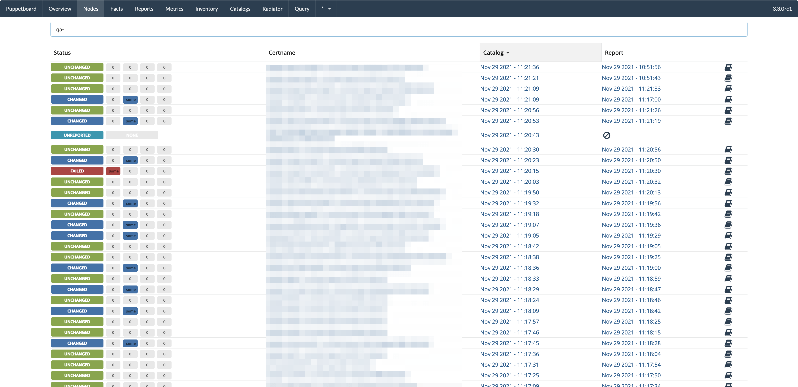

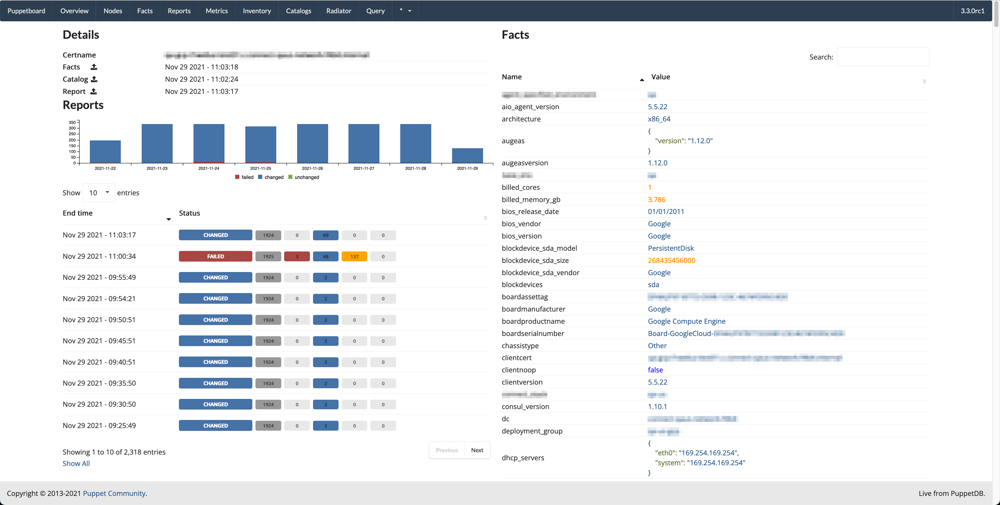

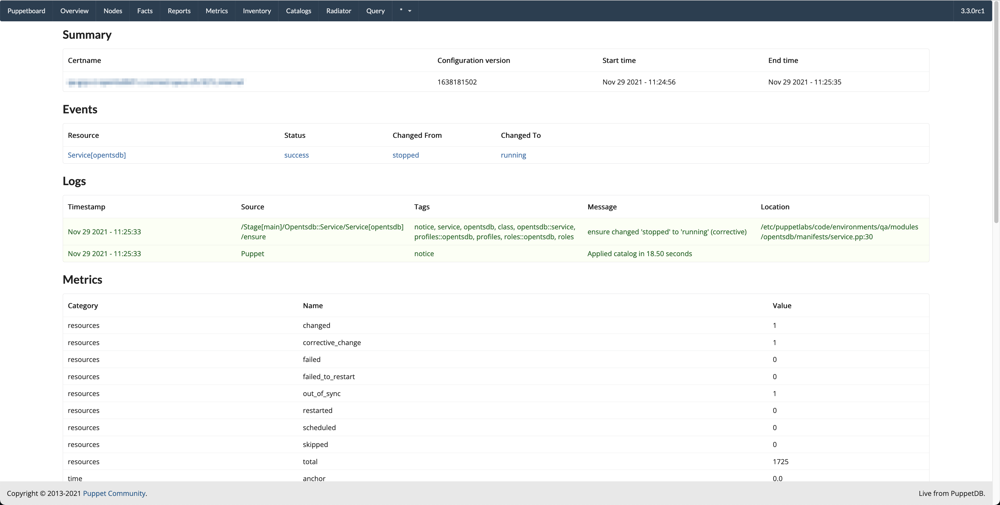

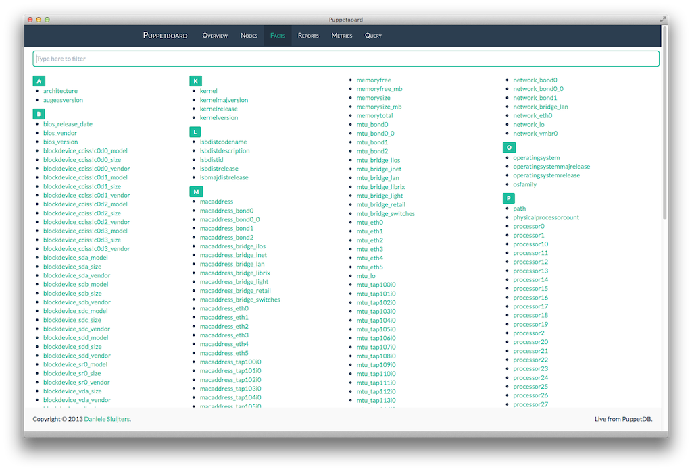

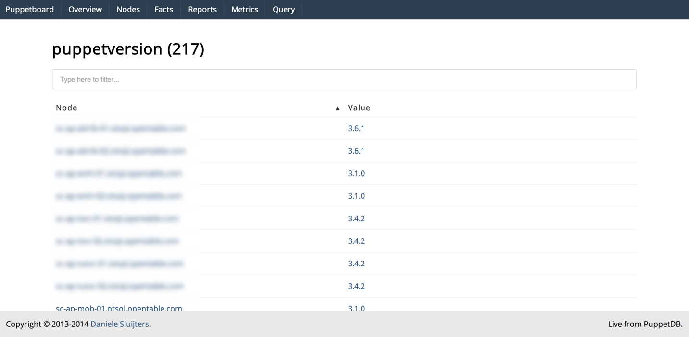

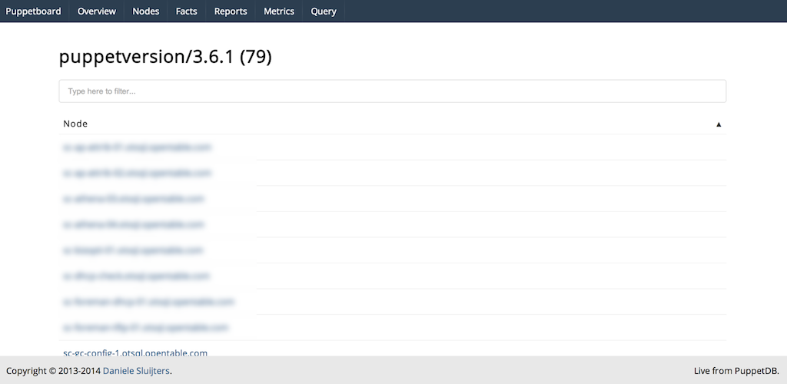

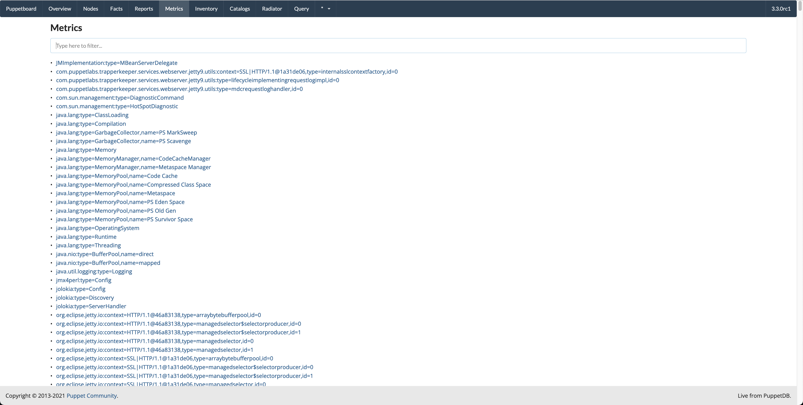

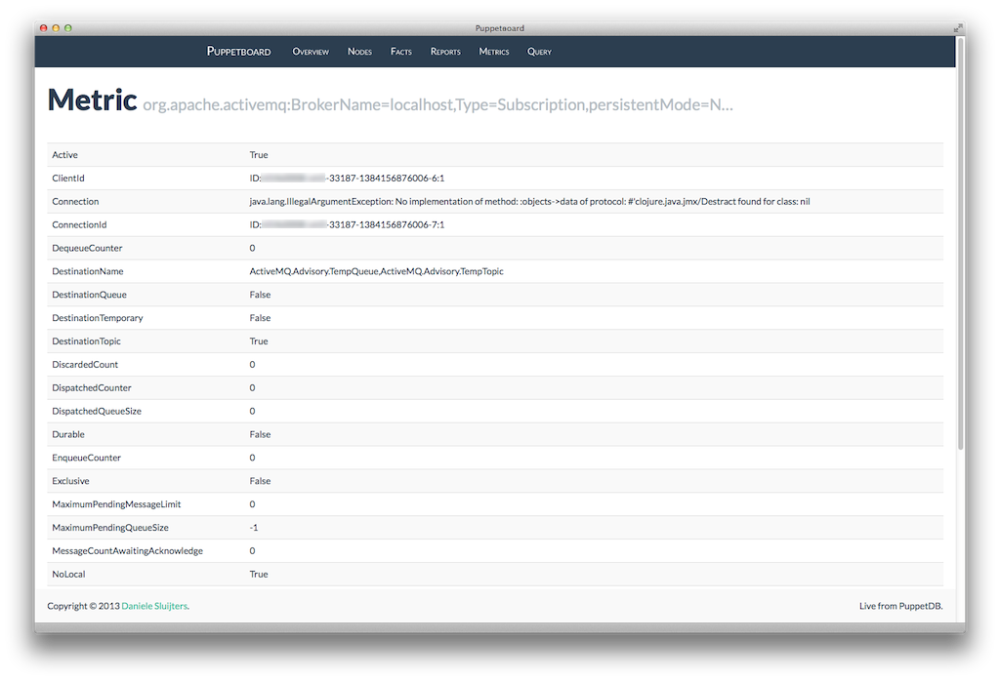

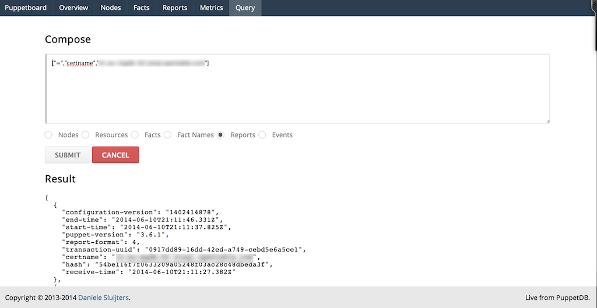

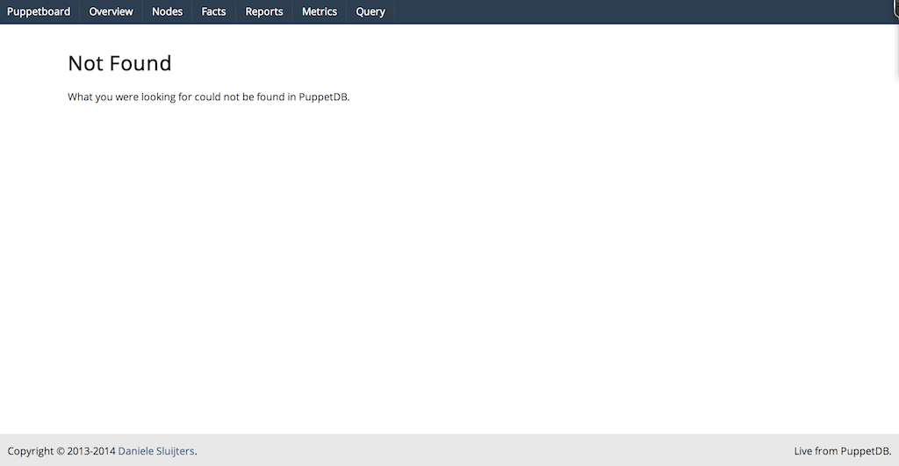
